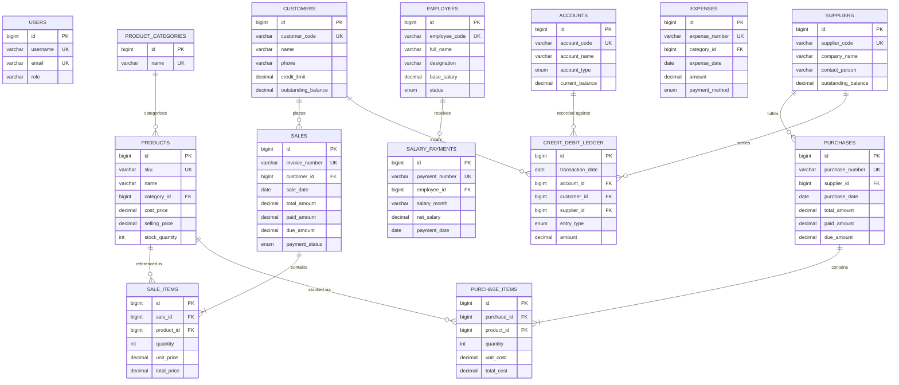

# Business Analytics System - Database Architecture & ERD

This document specifies the relational database schema design for the **Business Analytics System**, optimized for small and medium-scale businesses using MySQL 8.0+.

## Entity-Relationship Diagram (ERD)

## Relational Design Highlights

1. **Double-Entry Ledger Integrity**: The `credit_debit_ledger` and `accounts` tables maintain full auditability for every rupee/dollar flowing in or out of the business.
2. **Customer & Supplier Credit Tracking**: Receivables (customer dues) and payables (supplier dues) are tracked both in transactional documents (`sales`, `purchases`) and indexed contact balances (`customers.outstanding_balance`, `suppliers.outstanding_balance`).
3. **Flexible Inventory & Service Support**: Products support both physical inventory items with stock tracking (`reorder_level`) and billable service hours.
4. **Payroll & Operational Expenses**: Decoupled tables for routine operational overhead (`expenses`) and recurring staff compensation (`salary_payments`).
5. **Analytics Snapshots**: Pre-aggregated metrics in `monthly_analytics_snapshots` enable fast loading for long-term historical dashboards.
